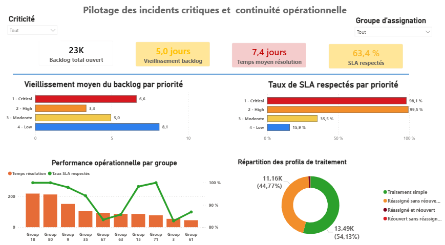
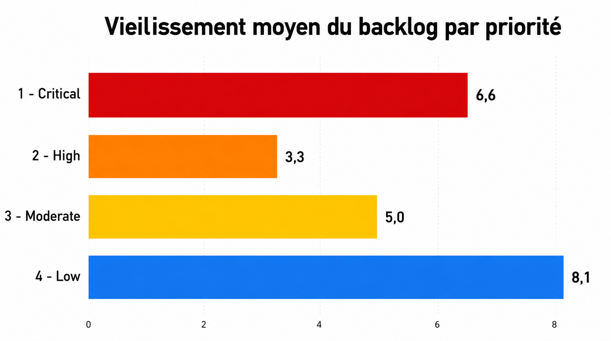
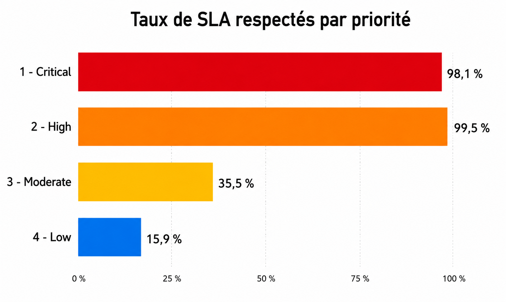
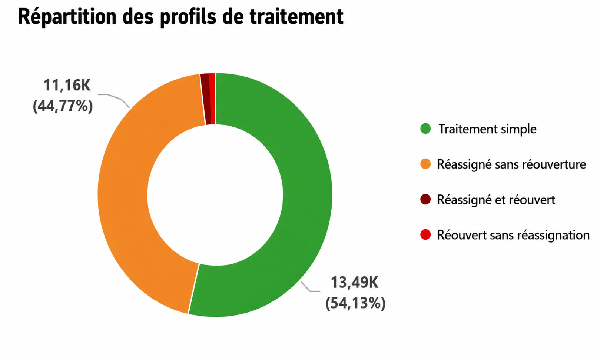
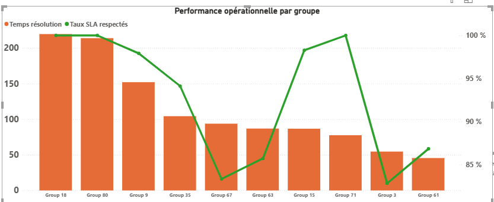

## Dashboard final

Le dashboard final a été conçu comme un outil de pilotage opérationnel pour suivre la performance du processus de gestion des incidents.

Il permet de visualiser les indicateurs clés liés au backlog, au vieillissement des tickets, au respect des SLA, aux délais de résolution et aux profils de traitement.

::: {.callout-note}
## Ce que permet ce dashboard

- surveiller les SLA critiques ;
- identifier les groupes sous tension ;
- suivre le vieillissement du backlog ;
- détecter les frictions de routage ;
- prioriser les actions opérationnelles.

:::

## Insights métier

### Dette opérationnelle sur les tickets faibles priorité

{width=85% fig-align="center"}

**Signal observé :** les incidents de priorité faible présentent le vieillissement moyen le plus élevé.

**Risque métier :** leur accumulation peut créer une dette opérationnelle et ralentir progressivement la capacité de traitement.

**Décision possible :** mettre en place des fenêtres dédiées au traitement du backlog ancien et suivre les tickets faibles priorité dépassant un seuil d'ancienneté.

### Les SLA critiques sont fortement préservés

**Signal observé :** les incidents critiques et élevés présentent les meilleurs taux de respect des SLA.

**Risque métier :** la forte priorisation des incidents critiques peut déplacer la pression opérationnelle vers les tickets modérés et faibles.

**Décision possible :** maintenir les mécanismes de priorisation critique tout en surveillant l'évolution du backlog non critique.

### Forte friction de routage opérationnel

**Signal observé :** une part importante des incidents est réassignée sans réouverture.

**Risque métier :** les réassignations successives peuvent augmenter les délais de traitement et accroître la charge des équipes support.

**Décision possible :** revoir les règles de dispatch, la catégorisation des incidents et les responsabilités de prise en charge entre niveaux support.

### Certains groupes concentrent la tension opérationnelle

**Signal observé :** certains groupes d'assignation présentent des temps moyens de résolution plus élevés que les autres.

**Risque métier :** ces groupes peuvent devenir des points de saturation opérationnelle et dégrader progressivement la qualité de service.

**Décision possible :** analyser la capacité des groupes concernés, les types d'incidents traités et les éventuels goulets d'étranglement.

---

[⬅️ Méthodologie analytique](methodologie-analytique.html)

[➡️ Recommandations et conclusion](recommandations-competences-et-conclusion.html)

