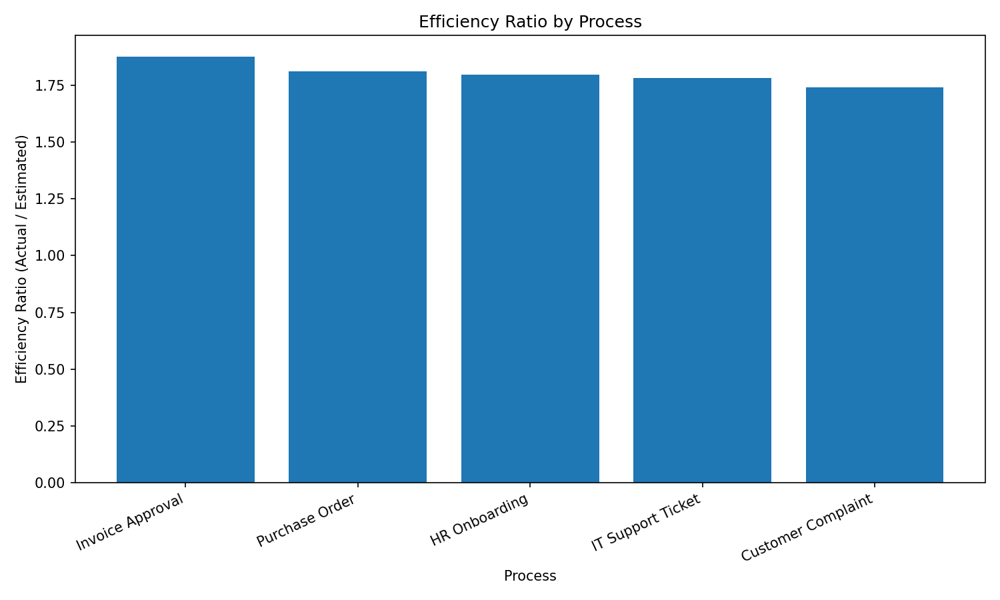
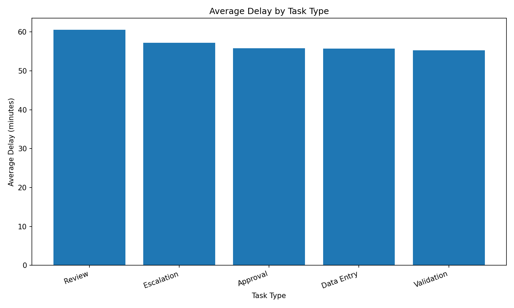
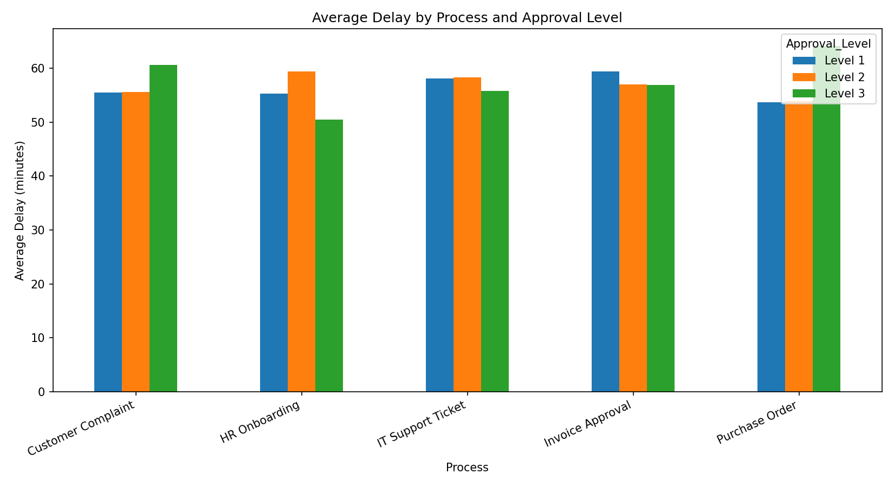

## Objectif

Cette section synthétise les résultats via **4 graphiques** (maximum) pour :
- communiquer rapidement les insights clés,
- appuyer les décisions recommandées,
- rendre le projet lisible pour un recruteur.

> Note : Les graphiques ci-dessous sont des exports figés (PNG) afin de garantir un rendu stable sur GitHub Pages.

---

## Efficacité par processus

**Question :** Quels processus sont les moins “prédictibles” (Actual / Estimated) ?

{width=900}

**Lecture rapide :**
- ratio > 1 : les durées réelles dépassent les estimations
- plus le ratio est haut, plus l’estimation est mal calibrée

---

## Retard moyen par type de tâche

**Question :** Quels types de tâches tirent le plus les retards ?

{width=900}

**Lecture rapide :**
- met en évidence les tâches les plus difficiles à estimer (ex. Review / Escalation)
- supporte les recommandations (standardisation, checklists, automatisation)

---

## Coût total des retards par processus

**Question :** Où est l’impact business le plus fort ?

{width=900}

**Lecture rapide :**
- priorisation par impact financier
- identifie le workflow “à traiter en premier” (ex. Purchase Order)

---

## Process × Approval (combinaisons à risque)

**Question :** Quelles combinaisons Process + Approval génèrent les retards les plus élevés ?

{width=1000}

**Lecture rapide :**
- révèle des segments “à risque” invisibles dans les moyennes globales
- cible des actions (simplification, délégation, automatisation)

---

## Référentiel des données de graphique (exports SQL)

Les graphiques ci-dessus sont construits à partir de tables exportées depuis DuckDB :

- `exports/efficiency_ratio_by_process.csv`
- `exports/avg_delay_by_task_type.csv`
- `exports/delay_cost_by_process.csv`
- `exports/process_approval_avg_delay.csv`

---
