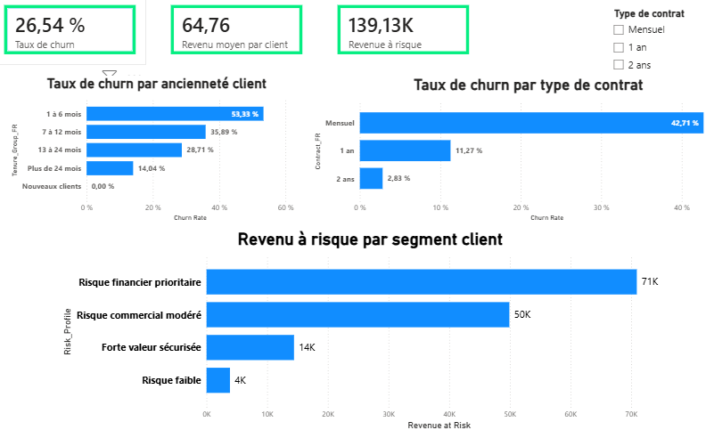
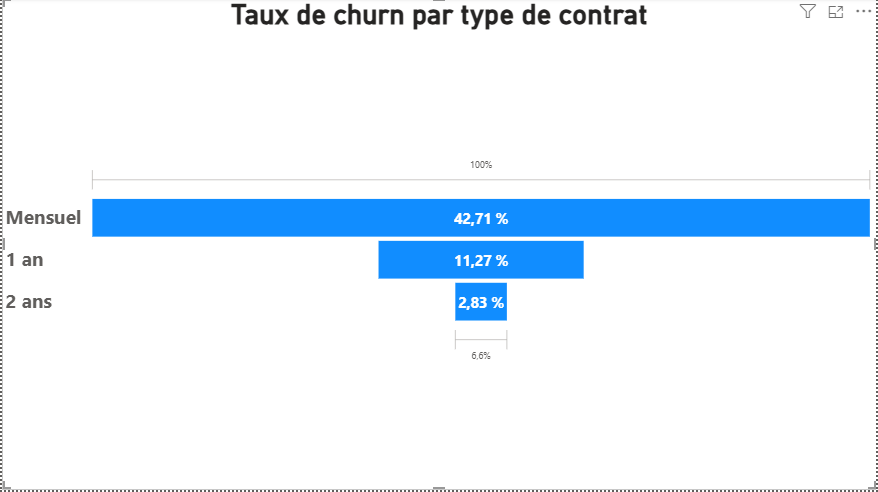
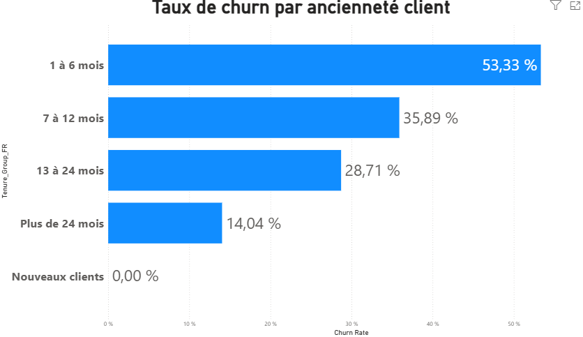
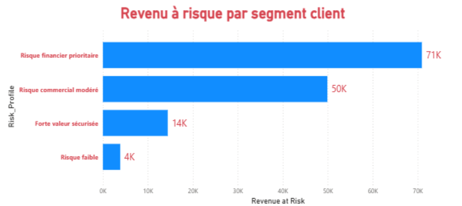

# Objectif de la visualisation

Cette page présente les visualisations utilisées pour transformer les indicateurs churn en lecture décisionnelle.

L’objectif n’est pas de produire des graphiques décoratifs, mais de rendre visibles :

- les segments clients les plus exposés à la résiliation ;
- les profils qui concentrent le revenu à risque ;
- les leviers de priorisation pour les actions de rétention ;
- les indicateurs clés à suivre dans un dashboard de pilotage.

---

# Vue d’ensemble du dashboard

{fig-alt="Dashboard Power BI de pilotage du churn, de l’ARPU et du revenu à risque" width="100%"}

Ce dashboard fournit une vue synthétique du churn, du revenu moyen par client et du revenu à risque.

Il permet de relier rapidement trois niveaux de lecture :

- **l’intensité du churn** : 26,54 % ;
- **la valeur moyenne client** : 64,76 ;
- **l’exposition financière** : 139,13K de revenu à risque.

L’intérêt du dashboard est de ne pas limiter l’analyse au volume de clients perdus, mais de relier la résiliation à son impact économique.

---

# KPI de pilotage

Le dashboard repose sur trois indicateurs de synthèse :

| KPI | Valeur observée | Rôle décisionnel |
|---|---:|---|
| Churn Rate | 26,54 % | Mesurer l’intensité de la résiliation |
| ARPU | 64,76 | Évaluer la valeur moyenne générée par client |
| Revenue at Risk | 139,13K | Quantifier le revenu exposé au churn |

Ces indicateurs permettent de passer d’une lecture descriptive du churn à une logique de pilotage orientée valeur client.

---

# Churn par type de contrat

{fig-alt="Taux de churn par type de contrat" width="90%"}

**Objectif**

Identifier les types de contrats les plus exposés à la résiliation.

**Lecture métier**

Le churn est nettement plus élevé sur les contrats mensuels, avec un taux de **42,71 %**, contre **11,27 %** pour les contrats d’un an et **2,83 %** pour les contrats de deux ans.

Cette différence suggère que les clients sans engagement long sont plus exposés au départ, probablement en raison :

- d’une faible barrière à la sortie ;
- d’une sensibilité plus forte aux offres concurrentes ;
- d’un engagement client plus fragile.

**👉 Décision associée**

Cette visualisation peut aider à prioriser les actions de rétention sur les clients en contrat mensuel, notamment par :

- des offres de migration vers des contrats plus engageants ;
- des avantages de fidélité ciblés ;
- un suivi renforcé des clients à forte valeur en contrat mensuel.

---

# Churn par ancienneté client

{fig-alt="Taux de churn par ancienneté client" width="90%"}

**Objectif**

Identifier les périodes de vie client où le risque de départ est le plus élevé.

**Lecture métier**

Le churn est particulièrement fort sur les clients ayant entre **1 et 6 mois d’ancienneté**, avec un taux de **53,33 %**.

Le taux diminue ensuite progressivement avec l’ancienneté :

- 35,89 % entre 7 et 12 mois ;
- 28,71 % entre 13 et 24 mois ;
- 14,04 % au-delà de 24 mois.

Cette lecture montre que la vulnérabilité client est très forte dans les premiers mois.

**👉 Décision associée**

Cette visualisation peut justifier la mise en place d’un dispositif de rétention précoce :

- programme d’onboarding renforcé ;
- contact client après souscription ;
- suivi de satisfaction dans les premiers mois ;
- offres de stabilisation avant la période critique.

---

# Revenu à risque par segment client

{fig-alt="Revenu à risque par segment client" width="95%"}

**Objectif**

Identifier les segments qui concentrent le plus fort impact financier potentiel.

**Lecture métier**

Le segment **Risque financier prioritaire** concentre environ **71K** de revenu à risque, devant le segment **Risque commercial modéré** avec environ **50K**.

Cela montre que tous les churns n’ont pas le même poids économique.

Un segment peut représenter un volume client limité, mais devenir prioritaire s’il concentre une forte valeur financière exposée.

**👉 Décision associée**

Cette visualisation permet de prioriser les actions de fidélisation selon l’impact financier réel, et non uniquement selon le nombre de clients perdus.

Elle aide à orienter :

- les budgets de rétention ;
- les campagnes commerciales ciblées ;
- les actions prioritaires sur les clients à forte valeur ;
- le suivi des segments les plus sensibles financièrement.

---

# Logique de priorisation

La priorisation ne doit pas reposer sur un seul indicateur.

Elle doit croiser :

- le taux de churn ;
- le niveau de revenu mensuel ;
- le type de contrat ;
- l’ancienneté client ;
- le revenu à risque.

Cette approche permet d’éviter une lecture trop globale du churn et de concentrer les efforts sur les segments à plus fort enjeu métier.

---

# Lecture décisionnelle

Une bonne visualisation ne se limite pas à montrer un écart.

Elle doit permettre de répondre rapidement à trois questions :

- où se situe le risque ?
- quel est son impact financier ?
- quelle action doit être priorisée ?

Dans cette analyse, la visualisation sert donc à passer d’une lecture descriptive du churn à une logique de pilotage de la rétention client.

---

# Limites de la visualisation

Les visualisations présentées doivent être interprétées avec prudence.

Le dataset est un jeu de données d’entraînement et ne reflète pas directement les données internes d’un opérateur réel.

Cependant, la logique analytique reste transposable à un contexte télécom opérationnel :

- segmentation client ;
- suivi du churn ;
- revenu à risque ;
- priorisation des actions de rétention ;
- pilotage de la performance commerciale.

---

# Ce que cette page démontre

Cette page démontre la capacité à :

- transformer des KPI en visualisations utiles ;
- relier les graphiques à des décisions concrètes ;
- structurer un dashboard orienté pilotage ;
- prioriser les actions à partir de signaux business ;
- présenter une analyse claire pour un décideur métier.

---

<a href="analyse_sql.html" class="nav-button">
⬅ Analyse SQL
</a>

<a href="business_insights.html" class="nav-button">
➡ Insights & recommandations
</a>

